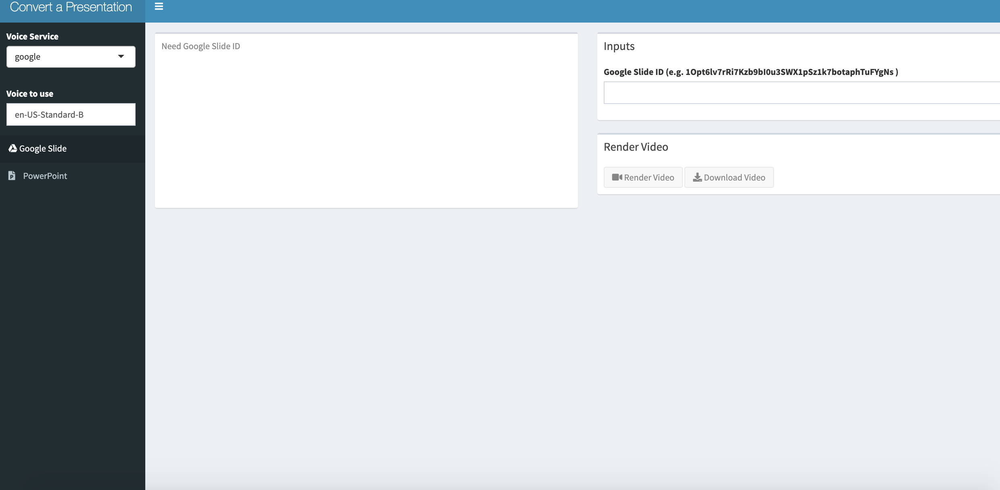

<!-- README.md is generated from README.Rmd. Please edit that file -->

```{r, include = FALSE}
knitr::opts_chunk$set(
  collapse = TRUE,
  comment = "#>"
)
library(googleLanguageR)
```
# presentation_to_video: A Shiny Application

<!-- badges: start -->
<!-- badges: end -->

The `presentation_to_video` Shiny application is to enable users to upload a PowerPoint (pptx) presentation or provide a link to a Google Slides presentation and create a video.  The video is generated by the slides with overlaid audio.  The overlaid audio is extracted as text from the speaker notes of the PowerPoint or Google Slides document.  This text is generated as audio using a Text-to-Speech service.  Currently, `presentation_to_video` only works with the Google Text-to-Speech API (https://cloud.google.com/text-to-speech/).  

```{r, echo = FALSE}

```

You should be able to run the app using:

```{r, eval = FALSE}
shiny::runApp()
```

if you have the app downloaded (after adding your authentication described below) or 

```{r, eval = FALSE}
shiny::runGitHub("muschellij2/presentation_to_video")
```

but that will not have the authentication needed to run the app.

## Setup

To set up the application, you need to authorize the Text-to-Speech API (https://cloud.google.com/text-to-speech/).  Authorization uses the [googleLanguageR](https://github.com/ropensci/googleLanguageR) package.  

Please go to https://github.com/ropensci/googleLanguageR#installation and follow the steps there.  You need to create a project, enable the text-to-speech API, then get a service account credential as a JSON file.  Name this JSON file, `google_authorization.json` and put in the directory of the application.

## Workaround for PPTX without LibreOffice

In order to create a video, we need to transform the slides into a set of PNGs.  We do this for PPTX by converting it to a PDF using [LibreOffice](https://www.libreoffice.org/), calling the `soffice` function.  This conversion is called using the [`docxtractr` package](https://github.com/hrbrmstr/docxtractr).  When publishing to `shinyapps.io`, you should make sure that `library(docxtractr)` is in your code.  This triggers `libreoffice` to be installed on your Shiny application, as we have added [the dependency for `docxtractr`](https://github.com/rstudio/shinyapps-package-dependencies/blob/master/packages/docxtractr/install).  

If `libreoffice` is not installed, then we have a workaround for converting PPTX to PDF.  We upload the data to a Google Drive account, using the [`googledrive`](https://github.com/tidyverse/googledrive) package, downloading the converted PDF, then deleting the file from that account.  In order to do this, you need to create a token outside of the app.  To do this, you can run:

```{r, eval = FALSE}
googledrive::drive_auth(cache = FALSE)
token = googledrive::drive_token()
saveRDS(token, file = "gtoken.rds")
```

where the file name of the `rds` file must be `gtoken.rds`, unless you change `token_fil` in `libreoffice_checks.R`.  You can see whether `libreoffice` is available in the logs for the application.  

## Known bugs

Uploading a `.pptx` file to `shinyapps.io` does not work, see https://community.rstudio.com/t/shinyapps-io-lua-errors-with-pptx/36944.  In order to upload a `.pptx` file, you have to zip the file.  For example, if you're uploading `example.pptx`, you would zip it and upload `example.pptx.zip` or `example.zip` where `example.pptx` would exist in the extracted zip folder.


# Choosing Your Voice

The [`text2speech`](https://github.com/muschellij2/text2speech) package is used for the audio generation.  In order to determine what voices are available, you can run `text2speech::tts_voices(service)`, where `service`   For example:

```{r}
voices = text2speech::tts_voices(service = "google")
voices = voices[ voices$language == "English (US)", ]
voices
```

For Google, there are standard or [`WaveNet`](https://cloud.google.com/text-to-speech/docs/wavenet) (a neural network) voices.  The WaveNet voices tend to sound more natural, but are more expensive to render.  You can hear the voices at https://cloud.google.com/text-to-speech/docs/voices.


# Finding packages

Here is are any versions of packages used for the app that may not be from CRAN:
```{r, include=FALSE}
pkgs = c(
  "animation",
  "shiny",
  "shinyjs",
  "docxtractr",
  "shinydashboard",
  "text2speech",
  "ari",
  "ariExtra",
  "googleAuthR",
  "googleLanguageR",
  "grid",
  "gridExtra",
  "png",
  "googledrive"
)
```

```{r, echo = FALSE}
x = sessioninfo::session_info(pkgs = pkgs)
x = x$packages
src = x$source
x = x[ !grepl("CRAN", src), ]
knitr::kable(x)
```
